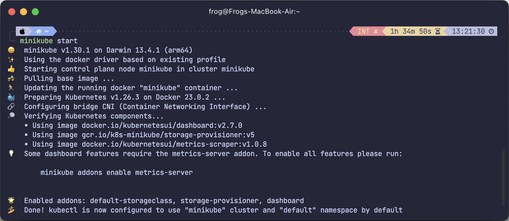
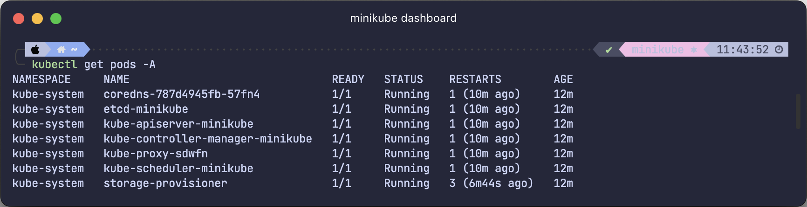
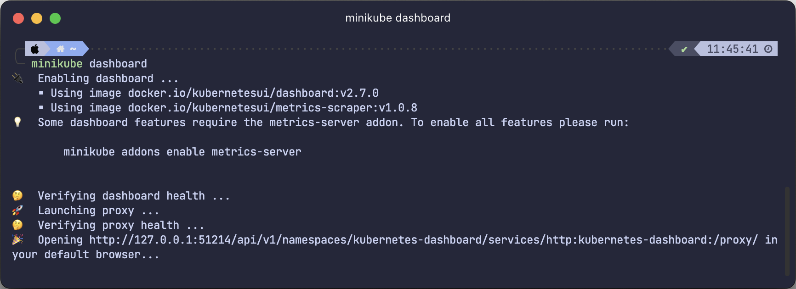
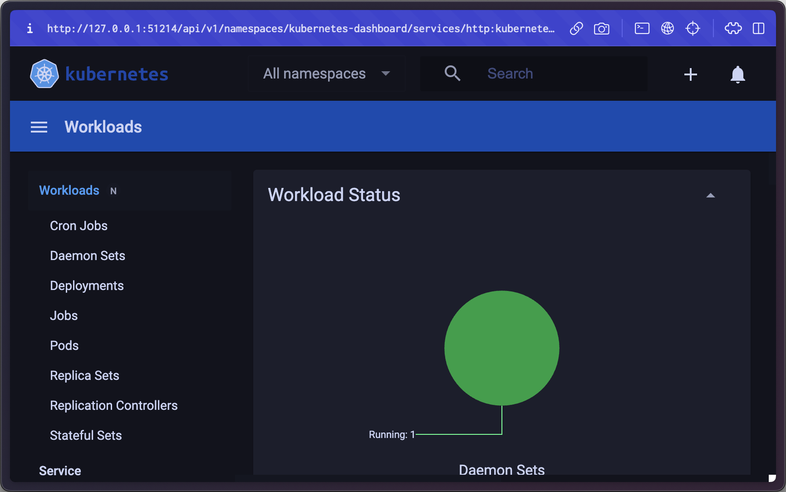

# DAY 1

**Requirement:**

- Docker / [Docker destop](https://www.docker.com/products/docker-desktop/)

### 1. Install minikube with homebrew

`brew install minikube`

### 2. Create minikube cluster

`minikube start`

### 3. Interact with cluster

Get all pods from all namespaces

`kubectl get po -A`

Start kubernetes dashboard

`minikube dashboard`

