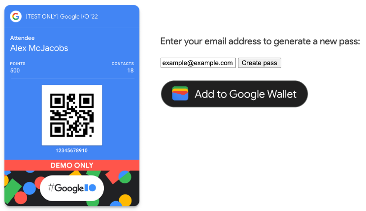

# DAY 6


## Containerize Node.js Google Wallet Passes Application

### 1. Initial Setup

First we must follow the guide in this [page](https://codelabs.developers.google.com/add-to-wallet-web#1) and finish the second (Setup) step. In the guide, the provisioning gcp project and service account is using *console*, but this time I use *terraform* to provision it.

Then we clone this [repo](https://github.com/google-pay/wallet-web-codelab).


`git clone https://github.com/google-pay/wallet-web-codelab.git`

There is two main folder here `web` and `web_complete`. This time we only need the `web_complete` and delete the rest.

I made changes to the code by introducing the *dotenv* package. Additionally, I stored the *ISSUERID* and Service Account credential as base64 in a `.env` file and utilized the environment variable as required.

Before we test the app, we must install the dependency pacakge by `npm install .` and run `node app.js` and see if the app is working or not.

Open the url on `http://localhost:3000` and it should look like this.



### 2. Containerize

This is the `Dockerfile` that I use.

```
FROM node:14
WORKDIR /usr/src/app
COPY . .
RUN npm install
EXPOSE 3000
CMD ["node", "app.js"]
```

We use the official node.js version 14 as the base image, copy the source on `/usr/src/app`, install dependency package, expose port 3000 where the app listening to, and run `node app.js` when the container started.

Then we build the Docker image.

`docker build -t google-wallet-api-passes`

We can try to run the image using this command. It run the image on detach mode and on port 80.

`docker run -d -p 80:3000 --name google-wallet-api-passes google-wallet-api-passes`

## Navigation

[`◀︎ PREVIOUS`](../day-5/README.md) ∙ [ `HOME` ](../../README.md) ∙ [`NEXT ▶︎`](../day-7/README.md)

## Reference

- [Create passes on Web using the Google Wallet API](https://codelabs.developers.google.com/add-to-wallet-web)