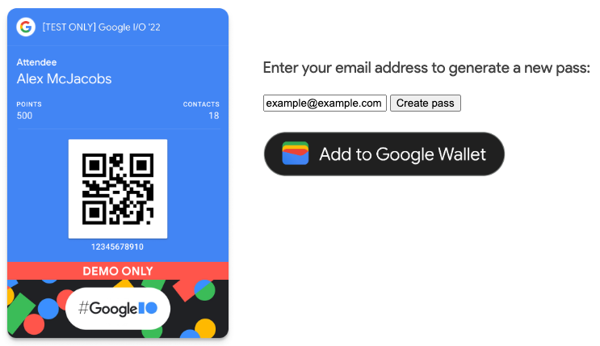

# DAY 7


## Deploy Node.js Google Wallet Passes Application on Minikube

### 1. Secret

Continuing from previous project, I need to create a secret manifest for the app.

```yaml
apiVersion: v1
kind: Secret
metadata:
  name: gwp-secret
type: Opaque
data:
  credential: ${CREDENTIAL}
  issuer-id: ${ISSUERID}
```

> Stored secret in manifest need to be bas64, but my variables on .env is already base64, so I need to encode the values to base64 again.

Export the variables on `.env` into the local environment variable so that we can substitute them into `secret.yaml` later.

```sh
export $(cat .env | grep -v ^# | xargs)
```

Substitue the env variables into the secret and chained to `kubectl apply`.

```sh
envsubst < secret.yaml | kubectl apply -f -
```

### 2. Deployment

Now we deploy the container into minikube. First I create a `deployment.yaml`.

```yaml
apiVersion: apps/v1
kind: Deployment
metadata:
  name: gwp-deploymennt
spec:
  replicas: 1
  selector:
    matchLabels:
      app: gwp
  template:
    metadata:
      labels:
        app: gwp
    spec:
      containers:
        - name: google-wallet-api-passes
          image: google-wallet-api-passes:latest
          imagePullPolicy: IfNotPresent
          ports:
            - containerPort: 3000
          resources:
            limits:
              cpu: 100m
              memory: 251Mi
          env:
            - name: CREDENTIAL
              valueFrom:
                secretKeyRef:
                  name: gwp-secret
                  key: credential
            - name: ISSUERID
              valueFrom:
                secretKeyRef:
                  name: gwp-secret
                  key: issuer-id
```

Apply the deployment.

```sh
kubectl apply -f deployment.yaml
```

If there is no problem, the events should look something like this:

```
Events:
  Type    Reason     Age    From               Message
  ----    ------     ----   ----               -------
  Normal  Scheduled  4m53s  default-scheduler  Successfully assigned default/gwp-deploymennt-5969ffd94d-2kmvb to minikube
  Normal  Pulled     4m53s  kubelet            Container image "google-wallet-api-passes:latest" already present on machine
  Normal  Created    4m53s  kubelet            Created container google-wallet-api-passes
  Normal  Started    4m53s  kubelet            Started container google-wallet-api-passes
```

### 2. Expose the app

Expose the service using NodePort on port 3000 for both side.

```yaml
apiVersion: v1
kind: Service
metadata:
  name: gwp-service
spec:
  selector:
    app: gwp
  ports:
    - protocol: TCP
      port: 3000
      targetPort: 3000
  type: NodePort
```

Applied the service manifest.

```sh
kubectl apply -f service.yaml
```

Create the minikube service tunnel.

```sh
minikube service gwp-service --url
```

Open the url provided and it should look like this.



## Navigation

[`◀︎ PREVIOUS`](../day-6/README.md) ∙ [ `HOME` ](../../README.md) ∙ [`NEXT ▶︎`](../day-8/README.md)

## Reference

- [Deployments](https://kubernetes.io/docs/concepts/workloads/controllers/deployment/)
